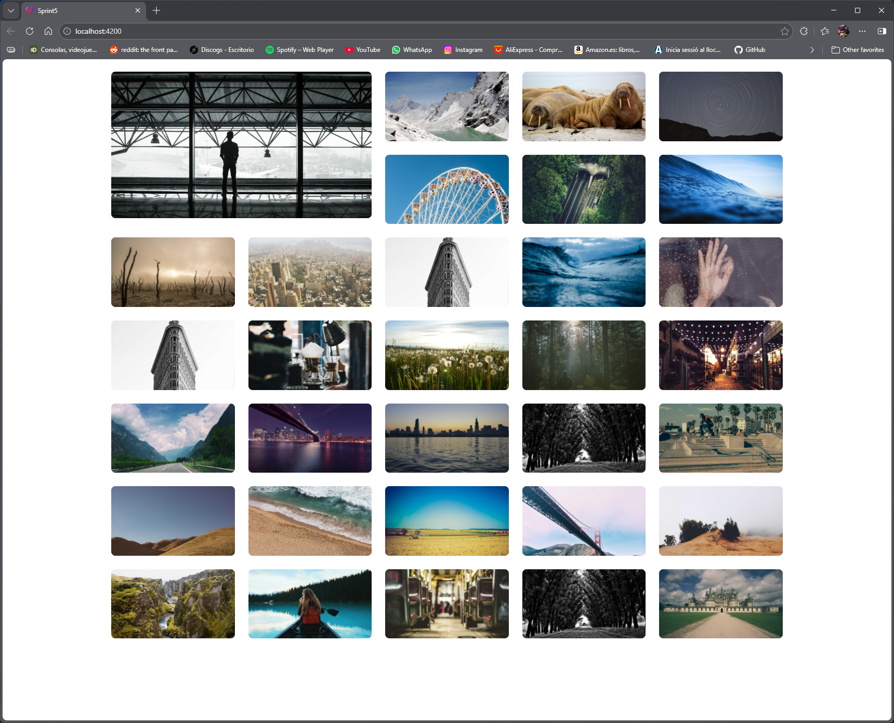
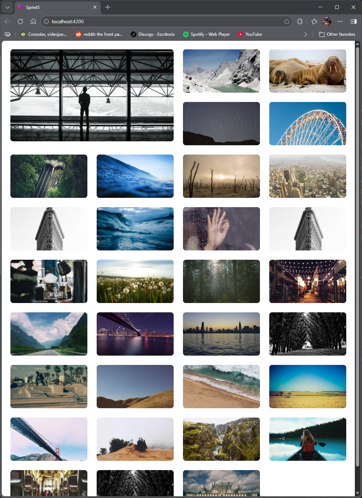
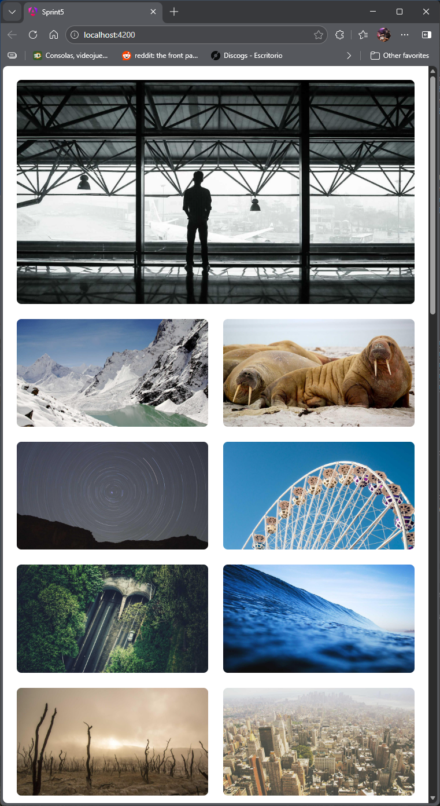

# angular-gallery

[](https://github.com/RichardLitt/standard-readme)


**Random image gallery, built with **Angular** and **Tailwind** , designed with a responsive approach.**

---

## Table of Contents

- [Background](#background)
- [Technologies](#technologies)
- [Structure](#structure)
- [Installation](#installation)
- [Features](#features)
- [Usage](#usage)
- [Testing](#testing)
- [Screenshots](#screenshots)
- [Images Source](#imagessource)
- [Maintainers](#maintainers)
- [Contributing](#contributing)
- [License](#license)

---

## Background

This project was my first glimpse into Angular. It's been a tough one, as I was still trying to cope with all the Typescript stuff from the previous one. I pulled through, but it's taken me longer than expected.

---

## Technologies

- HTML5
- TailWindCSS v4.1.17
- JavaScript ES6
- TypeScript v5.9.3
- Node.js v25.1.0
- Vite v7.2.2
- Vitest v4.0.14
- Angular 21.0.1

---

## Structure

```text
├── .angular/             # Angular cache (auto-generated)
├── .vscode/              # VSCode workspace settings
├── assets/               # Assets (imgs, etc)
├── dist/                 # Build output directory
├── node_modules/         # Installed dependencies (auto-generated)
├── public/               # Static assets served at root
│   └── favicon.ico       # Site favicon
├── src/                  # Application source code
│   ├── app/              # Main application module
│   │   ├── gallery/      # Gallery feature module
│   │   │   ├── gallery.css
│   │   │   ├── gallery.html
│   │   │   ├── gallery.specs.ts
│   │   │   └── gallery.ts
│   │   ├── image-item/   # Image item component
│   │   │   ├── image-item.css
│   │   │   ├── image-item.html
│   │   │   ├── image-item.specs.ts
│   │   │   └── image-item.ts
│   │   ├── app.config.server.ts
│   │   ├── app.config.ts
│   │   ├── app.css
│   │   ├── app.html
│   │   ├── app.routes.server.ts
│   │   ├── app.routes.ts
│   │   ├── app.specs.ts
│   │   └── app.ts
│   ├── image.ts          # Image type/interface
│   ├── index.html        # Main HTML entry point
│   ├── main.server.ts    # Server-side rendering entry
│   ├── main.ts           # Application bootstrap
│   ├── server.ts         # SSR server configuration
│   └── styles.css        # Global styles
├── .editorconfig         # Editor configuration
├── .gitignore            # Git ignored files
├── .postcssrc.json       # PostCSS configuration
├── angular.json          # Angular workspace configuration
├── package-lock.json     # Dependency lockfile (auto-generated)
├── package.json          # Project manifest (dependencies, scripts, metadata)
├── README.md             # Project documentation
├── tsconfig.app.json     # TypeScript config for app
├── tsconfig.json         # Base TypeScript configuration
└── tsconfig.spec.json    # TypeScript config for tests

```

---

## Installation

```text
# Clone the repository
git clone 
https://github.com/isaacmg-bit/Sprint_5.git
# Navigate to the project folder

# Launch project
In the terminal:

npm install
npm install -g @angular/cli@latest
npm install @angular/cdk
ng serve
Open the localserver that has been created
```

---

## Features

- Random fetch of images from Picsum. Every time we fill the gallery, it should all be different, random images.
- The first image of the gallery will be featured, using a different style from the others.
- Images can be deleted individually.
- Images can be moved using drag and drop.
- Auto gallery refill if all images are deleted.

---

## Usage

- To delete an image, just put the mouse over it and a trash icon should appear. Click it and a prompt will ask us to confirm or cancel the deletion.
- To move an image, click over any of the images and drag it to the desired position. We can move the featured image, or move a regular image to the featured position.
- If we delete the featured image, the next image on the list will be the featured one.
- If we delete all images, gallery will be filled automatically again.

---

## Testing

- To run the test suite, type `ng test` while in the project folder

---

## Screenshots






---

## ImagesSource

This project fetches pictures from **Picsum**,  a popular, free service that provides placeholder images for web development and design.

To fetch an image, it's as easy as changing the resolution in the URL provided:

https://picsum.photos/200/300 - This would render a 200x300 image.

In our app, we used a resolution of 1920x1080 for each picture (most common resolution worldwide) and to make it completely random, each image is fetched with the timestamp of that same moment:

https://picsum.photos/1920/1080?random=${Date.now()}-${i}

---

## Maintainers

[@Isaac Malagón](https://github.com/isaacmg-bit)

---

## Contributing
```text
1. Fork this repository
2. Create a new branch (`git checkout -b feature/your-feature`)
3. Make your changes and commit (`git commit -m 'Add new feature'`)
4. Push to your branch (`git push origin feature/your-feature`)
5. Create a Pull Request
````

**Pull requests** are welcome.  
If you edit the README, please make sure to follow the  
[standard-readme](https://github.com/RichardLitt/standard-readme) specification.

---

## License

This work is licensed under a [Creative Commons Attribution-NonCommercial 4.0 International License](https://creativecommons.org/licenses/by-nc/4.0/).  
© 2025 Isaac Malagón — Commercial use and redistribution are not allowed without permission.
